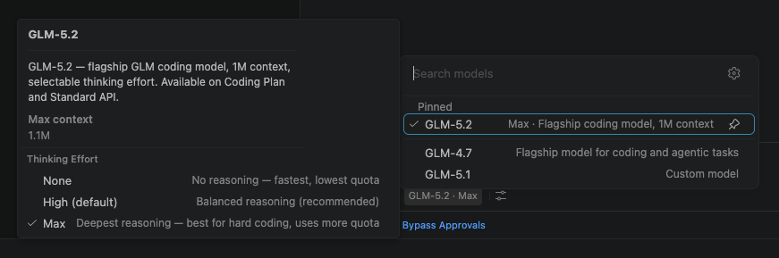

# GLM Models for GitHub Copilot Chat

[](https://marketplace.visualstudio.com/items?itemName=yijiazhen-qi.glm-for-github-copilot-chat)
[](https://marketplace.visualstudio.com/items?itemName=yijiazhen-qi.glm-for-github-copilot-chat)
[](https://github.com/KiwiGaze/glm-for-copilot/actions/workflows/ci.yml)
[](LICENSE.txt)

<p align="center">
  
</p>

**Pick GLM-5.2 — Zhipu's flagship 1M-context coding model — right from the Copilot Chat model picker, alongside the full GLM lineup (GLM-5.1, GLM-5, GLM-4.7, GLM-4.5 Air). And keep everything else Copilot already gives you.**

Use your own GLM API key (BYOK) to bring Zhipu AI's GLM models into GitHub Copilot Chat. No new sidebar, no new chat UI. Just new models in the picker you already use — with agent mode, tool calling, and thinking mode all working out of the box.

> **Unofficial, community-built extension.** Not affiliated with, endorsed by, or sponsored by Zhipu AI, Z.ai, GitHub, or Microsoft. "GLM", "Copilot", and "Visual Studio Code" are trademarks of their respective owners. You bring your own GLM API key and pay your own usage.

## Why this extension?

- **Don't replace Copilot — power it up.** GLM models appear alongside GPT-4o, Claude, and others in the existing model picker.
- **Agent mode, tool calling, instructions, MCP — all still work.** Copilot's full stack now runs on GLM.
- **Watch GLM think.** The model's step-by-step reasoning streams into the chat — a transparency Copilot's built-in BYOK doesn't expose.
- **BYOK, your bill.** Your API key lives in the OS keychain, never in `settings.json` or your Git history.
- **Dual API.** Use your GLM Coding Plan subscription or the pay-as-you-go Standard API, whichever fits your workflow.
- **Zero runtime dependencies.** Pure VS Code API and Node.js built-ins. No Python, no Docker, no local server.

## Features

### GLM-5.2 and the full GLM lineup in the model picker

GLM-5.2 — the flagship, with a 1M-token context window — plus GLM-5.1, GLM-5, GLM-4.7, and GLM-4.5 Air appear in Copilot Chat's model selector. The picker **automatically shows only the models available for your selected API Mode** (some models are exclusive to the Coding Plan or the Standard API — see the [Models](#models) table). Switch models mid-chat without losing history.

### Dual API: Coding Plan and Standard

Choose between your Z.ai GLM Coding Plan subscription or the pay-as-you-go Standard API. For Standard, pick International (`z.ai`) or Mainland China (`bigmodel.cn`) as your region. See [Coding Plan vs Standard API](#coding-plan-vs-standard-api) below.

### Coding Plan usage tracking

If you're on a GLM Coding Plan (International / `z.ai` region), a status-bar item shows your live quota, and **GLM: Show Usage Details** opens the full panel: session (5-hour rolling) and weekly (7-day rolling) limits, monthly web searches, your plan, and when each resets. It refreshes automatically, and the status-bar item can be hidden if you prefer.

<p align="center">
  
</p>

### Custom models

Add your own GLM model ids with the `glm-copilot.customModels` setting — useful for newly released models, fine-tunes, or proxy-hosted models. Each entry is a model id string or an object with optional `name`, `maxInputTokens`, `maxOutputTokens`, `toolCalling`, `vision`, and `thinking`. Custom models always appear in the picker and are sent to your active endpoint.

### Thinking mode

GLM models support a thinking (step-by-step reasoning) mode, controlled by the `glm-copilot.thinking` setting (`enabled` by default). Set it to `disabled` for faster responses on simple edits. GLM-5.2 adds a per-model **Thinking Effort** picker (None / High / Max) in the Copilot model picker, and the choice persists per model.

<p align="center">
  
</p>

### Secure API key storage

Your key is stored in VS Code's `SecretStorage` (the OS keychain on macOS, Windows, and Linux). It never touches `settings.json`.

### Inherits every Copilot capability

Because this extension plugs into Copilot's native Language Model Provider API, you get Copilot's full stack at no extra cost:

- **Agent mode** — autonomous multi-step tasks
- **Tool calling** — file edits, terminal, workspace search, Git, and more
- **Instructions and skills** — your `.instructions.md`, `AGENTS.md`, and skills work as normal
- **MCP servers** — any MCP tools you have configured keep working

## Getting Started

### Prerequisites

- VS Code 1.116 or later
- An active GitHub Copilot subscription (Free, Pro, or Enterprise)
- A GLM API key from [z.ai](https://z.ai/manage-apikey/apikey-list) or [bigmodel.cn](https://open.bigmodel.cn/usercenter/proj-mgmt/apikeys), or a GLM Coding Plan subscription

### Installation

Install from the **[VS Code Marketplace](https://marketplace.visualstudio.com/items?itemName=yijiazhen-qi.glm-for-github-copilot-chat)**, or search for **"GLM Models for GitHub Copilot Chat"** in the Extensions panel (`Cmd/Ctrl + Shift + X`). From the command line:

```bash
code --install-extension yijiazhen-qi.glm-for-github-copilot-chat
```

If you installed an older Marketplace listing, uninstall it before installing this one. The old and new extension IDs can both register the same `glm-copilot.*` commands and settings.

```bash
code --uninstall-extension YijiazhenQi.glm-for-copilot-chat
code --install-extension yijiazhen-qi.glm-for-github-copilot-chat
```

### Usage

1. Open the Command Palette (`Cmd/Ctrl + Shift + P`) and run **GLM: Set API Key**.
2. Paste your GLM API key. GLM key format is `{id}.{secret}`.
3. (Optional) Open **GLM: Open Settings** to choose your API mode and region.
4. Open Copilot Chat, click the model picker, and select a GLM model (e.g. **GLM-5.2**, the flagship).
5. Start chatting.

To update or remove the key later, use **GLM: Set API Key** or **GLM: Clear API Key** from the Command Palette.

## Models

| Model | Tier | Context | Max Output | Available on | Tools | Thinking |
|---|---|---|---|---|---|---|
| **GLM-5.2** | Flagship | 1M | 128K | Coding Plan + Standard | Yes | Yes (effort) |
| **GLM-5.1** | Legacy | 200K | 128K | Standard only | Yes | Yes |
| **GLM-5** | Legacy | 200K | 128K | Standard only | Yes | Yes |
| **GLM-4.7** | Legacy | 200K | 128K | Coding Plan + Standard | Yes | Yes |
| **GLM-4.5 Air** | Legacy | 128K | 96K | Coding Plan + Standard | Yes | Yes |

Lead with the flagship **GLM-5.2** — a 1M-token context window and a per-model Thinking Effort control. The picker shows only the models available for your selected **API Mode**, so you never pick a model your plan can't serve. GLM-5.2, GLM-4.7, and GLM-4.5 Air work on both the Coding Plan and Standard API; GLM-5 and GLM-5.1 are Standard-API only. Need another model? Add it with [`glm-copilot.customModels`](#settings).

## Settings

| Setting | Default | Description |
|---|---|---|
| `glm-copilot.apiMode` | `coding-plan` | Which GLM API to use: `coding-plan` or `standard`. See below. |
| `glm-copilot.region` | `international` | Server region for **both** API modes: `international` (z.ai) or `china` (bigmodel.cn). Ignored only when `baseUrl` is set. |
| `glm-copilot.baseUrl` | *(empty)* | Override the API base URL. Overrides `apiMode` and `region`. Use for proxies or compatible APIs. |
| `glm-copilot.maxTokens` | `0` | Maximum output tokens per request. `0` means no explicit limit (uses API default). |
| `glm-copilot.thinking` | `enabled` | Step-by-step reasoning: `enabled` (higher quality) or `disabled` (faster). Applies to models that support thinking. |
| `glm-copilot.customModels` | `[]` | Add your own models. Array of model id strings or objects: `{ id, name?, maxInputTokens?, maxOutputTokens?, toolCalling?, vision?, thinking? }`. |
| `glm-copilot.modelIdOverrides` | `{}` | Remap a built-in model's API id (keys = picker id, values = id sent to the API). Use for regional endpoints or proxies with different names. |
| `glm-copilot.debugLogging` | `false` | Write verbose debug logs to the GLM output channel. View with **GLM: Show Logs**. |
| `glm-copilot.usageRefreshIntervalMinutes` | `15` | How often (in minutes) to refresh the Coding Plan usage status bar. Minimum `5`. Coding Plan on the International (z.ai) region only. |
| `glm-copilot.showUsageStatusBar` | `true` | Show the Coding Plan usage status-bar item. Coding Plan on the International (z.ai) region only. |

## Coding Plan vs Standard API

### Coding Plan

Requires a GLM Coding Plan subscription. The endpoint depends on your `region`:

| Region | Endpoint | Key page |
|---|---|---|
| International | `https://api.z.ai/api/coding/paas/v4` | [z.ai/manage-apikey/subscription](https://z.ai/manage-apikey/subscription) |
| Mainland China | `https://open.bigmodel.cn/api/coding/paas/v4` | [bigmodel.cn/coding-plan](https://bigmodel.cn/coding-plan/personal/overview) |

Best for teams or high-volume coding workflows.

### Standard API

Pay-as-you-go via the GLM Open Platform. The endpoint depends on your `region`:

| Region | Endpoint | Key page |
|---|---|---|
| International | `https://api.z.ai/api/paas/v4` | [z.ai/manage-apikey/apikey-list](https://z.ai/manage-apikey/apikey-list) |
| Mainland China | `https://open.bigmodel.cn/api/paas/v4` | [open.bigmodel.cn](https://open.bigmodel.cn/usercenter/proj-mgmt/apikeys) |

Full API documentation: [docs.z.ai](https://docs.z.ai)

## Commands

| Command | Description |
|---|---|
| **GLM: Set API Key** | Set or update your GLM API key |
| **GLM: Get API Key** | Open the key management page for your selected API mode |
| **GLM: Clear API Key** | Remove your stored API key |
| **GLM: Open Settings** | Open the extension settings |
| **GLM: Show Logs** | Open the GLM output channel |

## Frequently asked questions

### Is this an official GLM or GitHub extension?

No. It is an unofficial, community-built, open-source extension. It is not affiliated with Zhipu AI, Z.ai, GitHub, or Microsoft. It simply lets you use your own GLM API key inside GitHub Copilot Chat.

### Do I still need a GitHub Copilot subscription?

Yes. This extension adds GLM models *to* Copilot Chat; it does not replace Copilot. You need an active GitHub Copilot subscription (Free, Pro, or Enterprise) and your own GLM API key.

### Where does my API key go? Is it safe?

Your key is stored in VS Code's `SecretStorage` (the OS keychain on macOS, Windows, and Linux) and is sent only to the GLM endpoint you configure (`api.z.ai` or `open.bigmodel.cn`) over HTTPS. It is never written to `settings.json` and never committed to your repository.

### Should I choose the Coding Plan or the Standard API?

Pick **Coding Plan** if you have a [Z.ai GLM Coding Plan](https://z.ai/manage-apikey/subscription) subscription — best for high-volume coding. Pick **Standard** for pay-as-you-go usage through the GLM Open Platform. See [Coding Plan vs Standard API](#coding-plan-vs-standard-api).

### Why don't I see a model I expected in the picker?

The picker shows only the models available for your selected **API Mode**. GLM-5.2, GLM-4.7, and GLM-4.5 Air work on both; GLM-5 and GLM-5.1 are Standard-API only. To force-add any model (including new or proxy-hosted ones), use the [`glm-copilot.customModels`](#settings) setting.

### Does agent mode, tool calling, and MCP work?

Yes. Because the extension plugs into Copilot's native Language Model Provider API, Copilot's full stack — agent mode, tool calling, instructions, and MCP servers — runs on GLM unchanged.

### Is GLM-4.6 still supported?

GLM-4.6 was replaced by GLM-4.7 and the GLM-5 series in v0.2.0. You can still add it yourself with `glm-copilot.customModels` if your account serves it.

### Can I point it at a proxy or self-hosted endpoint?

Yes. Set `glm-copilot.baseUrl` to any OpenAI-compatible endpoint; it overrides the API mode and region.

## Contributing

Contributions are welcome. Please read the [contributing guide](CONTRIBUTING.md) and our [Code of Conduct](CODE_OF_CONDUCT.md). All pull requests require review from a code owner and are never merged automatically.

- **Found a bug?** [Open a bug report](https://github.com/KiwiGaze/glm-for-copilot/issues/new?template=bug_report.yml).
- **Want a feature?** [Open a feature request](https://github.com/KiwiGaze/glm-for-copilot/issues/new?template=feature_request.yml).
- **Need help?** See [Support](SUPPORT.md) or start a [Discussion](https://github.com/KiwiGaze/glm-for-copilot/discussions).
- **Found a security issue?** See our [Security policy](SECURITY.md).

## Changelog

See [CHANGELOG.md](CHANGELOG.md) for release history.

## License

[MIT](LICENSE.txt) © GLM Models for GitHub Copilot Chat contributors
