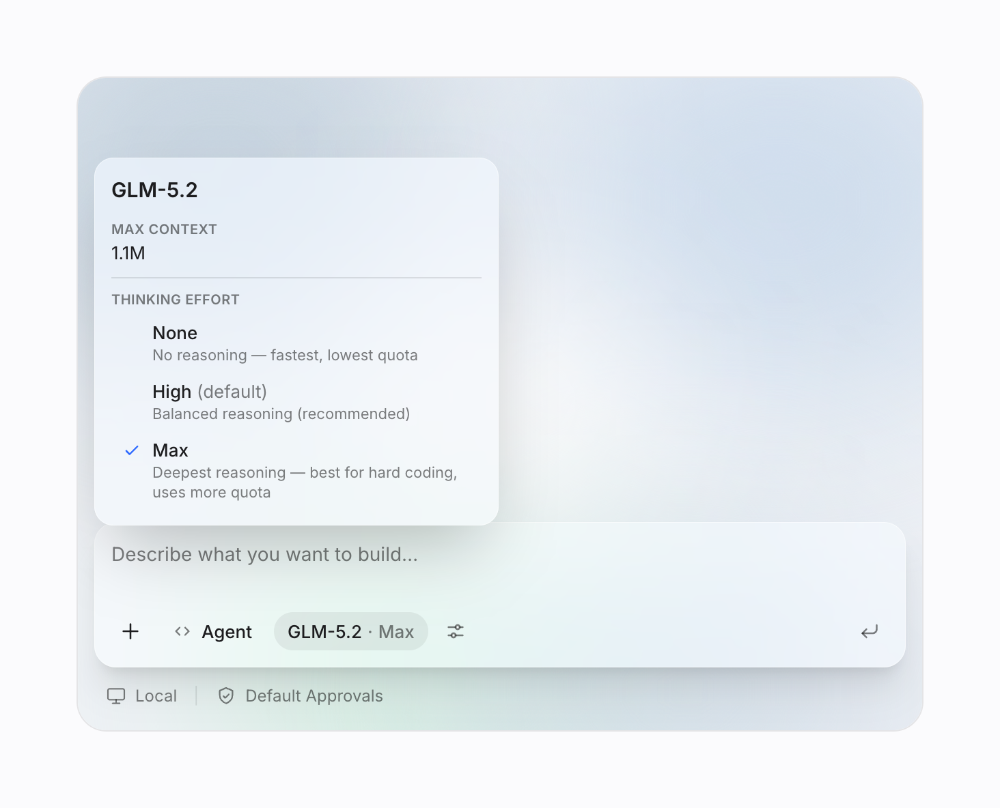
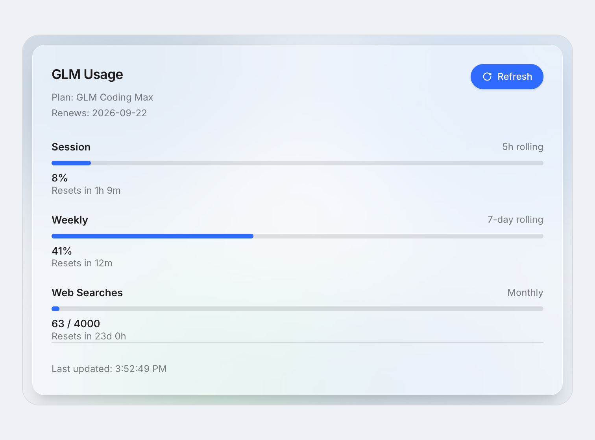

# GLM Models for GitHub Copilot Chat

[](https://marketplace.visualstudio.com/items?itemName=yijiazhen-qi.glm-for-github-copilot-chat)
[](https://marketplace.visualstudio.com/items?itemName=yijiazhen-qi.glm-for-github-copilot-chat)
[](https://github.com/KiwiGaze/glm-for-copilot/actions/workflows/ci.yml)
[](LICENSE.txt)

<p align="center">
  
</p>

Use your own GLM API key (BYOK) to bring Z.AI's GLM models into GitHub Copilot Chat — **GLM-5.2**, the 1M-context flagship built for long-horizon coding, plus a curated GLM lineup (GLM-5.1, GLM-5, GLM-4.7, GLM-4.5 Air). No new sidebar or chat UI: the models appear in the picker you already use, with agent mode, tool calling, and thinking mode available through Copilot's native provider path.

> **Unofficial, community-built extension.** Not affiliated with, endorsed by, or sponsored by Zhipu AI, Z.AI, GitHub, or Microsoft. "GLM", "Copilot", and "Visual Studio Code" are trademarks of their respective owners. You bring your own GLM API key and pay your own usage.

## Features

- **GLM-5.2 flagship, right in the picker.** A 1M-token context window, step-by-step thinking that streams live into the chat, and a per-model **Thinking Effort** control (None / High / Max). Choose None for faster simple edits. Switch models mid-chat without losing history.

- **Powers Copilot up, doesn't replace it.** GLM models appear alongside GPT and Claude. Because the extension plugs into Copilot's native Language Model Provider API, Copilot agent mode and tool calling continue through the normal chat experience.
- **Dual API.** Use your **GLM Coding Plan** subscription or the pay-as-you-go **Standard API** — each available International (`z.ai`) or Mainland China (`bigmodel.cn`). See [Coding Plan vs Standard API](#coding-plan-vs-standard-api).
- **Live Coding Plan usage.** A status-bar quota readout, **GLM: Refresh Usage** on demand, and a full **GLM: Show Usage Details** panel — session (5-hour) and weekly (7-day) limits, monthly web searches, and reset countdowns. Refreshes automatically; the status-bar item can be hidden. Coding Plan, International region, no `baseUrl` override.

<p align="center">
  
</p>

- **Keys stay in your OS keychain by default.** **GLM: Set API Key** stores your key via VS Code `SecretStorage` (macOS, Windows, Linux). The extension also honors a settings fallback for CI or automation, so do not put real keys in workspace settings.
- **Zero runtime dependencies.** Pure VS Code API and Node.js built-ins. No Python, Docker, or local server.
- **Add any model.** Newly released, fine-tuned, or proxy-hosted GLM models via [`glm-copilot.customModels`](#settings).

## Getting Started

### Prerequisites

- VS Code 1.116 or later
- An active GitHub Copilot subscription (Free, Pro, or Enterprise)
- A GLM API key from [z.ai](https://z.ai/manage-apikey/apikey-list) or [bigmodel.cn](https://open.bigmodel.cn/usercenter/proj-mgmt/apikeys), or a GLM Coding Plan subscription

### Installation

Install from the **[VS Code Marketplace](https://marketplace.visualstudio.com/items?itemName=yijiazhen-qi.glm-for-github-copilot-chat)**, or search **"GLM Models for GitHub Copilot Chat"** in the Extensions panel (`Cmd/Ctrl + Shift + X`):

```bash
code --install-extension yijiazhen-qi.glm-for-github-copilot-chat
```

Upgrading from an older Marketplace listing? Uninstall it first — the old and new IDs can both register the same `glm-copilot.*` commands and settings:

```bash
code --uninstall-extension YijiazhenQi.glm-for-copilot-chat
code --install-extension yijiazhen-qi.glm-for-github-copilot-chat
```

### Usage

1. **GLM: Set API Key** (Command Palette, `Cmd/Ctrl + Shift + P`) → paste your key. GLM key format is `{id}.{secret}`.
2. (Optional) **GLM: Open Settings** to choose your API mode and region.
3. Open Copilot Chat, pick a GLM model (e.g. **GLM-5.2**, the flagship), and start chatting.

Use **GLM: Set API Key** or **GLM: Clear API Key** to update or remove the key later.

## Models

| Model | Tier | Context | Max Output | Available on | Tools | Thinking |
|---|---|---|---|---|---|---|
| **GLM-5.2** | Flagship | 1M | 128K | Coding Plan + Standard | Yes | Yes (effort) |
| **GLM-5.1** | Prior flagship | 200K | 128K | Standard only | Yes | Yes |
| **GLM-5** | Prior flagship | 200K | 128K | Standard only | Yes | Yes |
| **GLM-4.7** | Fast coding | 200K | 128K | Coding Plan + Standard | Yes | Yes |
| **GLM-4.5 Air** | Lightweight | 128K | 96K | Coding Plan + Standard | Yes | Yes |

The picker shows only the models your selected **API Mode** can serve, so you never pick a model your plan can't use. GLM-5.2, GLM-4.7, and GLM-4.5 Air work on both; GLM-5 and GLM-5.1 are Standard-only. Need a model not listed — a newly released one like GLM-5-Turbo, an older one like GLM-4.6, or a proxy-hosted id? Add it with [`glm-copilot.customModels`](#settings).

## Settings

| Setting | Default | Description |
|---|---|---|
| `glm-copilot.apiMode` | `coding-plan` | Which GLM API to use: `coding-plan` or `standard`. See below. |
| `glm-copilot.region` | `international` | Server region for **both** API modes: `international` (z.ai) or `china` (bigmodel.cn). Ignored only when `baseUrl` is set. |
| `glm-copilot.baseUrl` | *(empty)* | Override the API base URL. Overrides `apiMode` and `region`. Use for proxies or compatible APIs. |
| `glm-copilot.maxTokens` | `0` | Maximum output tokens per request. `0` means no explicit limit (uses API default). |
| `glm-copilot.thinking` | `enabled` | Step-by-step reasoning: `enabled` (higher quality) or `disabled` (faster). Applies to thinking-capable models without a per-model Thinking Effort picker; GLM-5.2 uses None / High / Max in the model picker. |
| `glm-copilot.customModels` | `[]` | Add your own models. Array of model id strings or objects: `{ id, name?, maxInputTokens?, maxOutputTokens?, toolCalling?, vision?, thinking? }`. |
| `glm-copilot.modelIdOverrides` | `{}` | Remap a built-in model's API id (keys = picker id, values = id sent to the API). Use for regional endpoints or proxies with different names. |
| `glm-copilot.debugLogging` | `false` | Write verbose debug logs to the GLM output channel. View with **GLM: Show Logs**. |
| `glm-copilot.usageRefreshIntervalMinutes` | `15` | How often (in minutes) to refresh the Coding Plan usage status bar. Minimum `5`. Coding Plan on the International (z.ai) region only, with no `baseUrl` override. |
| `glm-copilot.showUsageStatusBar` | `true` | Show the Coding Plan usage status-bar item. Coding Plan on the International (z.ai) region only, with no `baseUrl` override. |

## Coding Plan vs Standard API

**Coding Plan** requires a GLM Coding Plan subscription — best for teams or high-volume coding. **Standard API** is pay-as-you-go via the GLM Open Platform. The endpoint follows your `region` either way.

| Mode | Region | Endpoint | Get a key |
|---|---|---|---|
| Coding Plan | International | `https://api.z.ai/api/coding/paas/v4` | [z.ai/manage-apikey/subscription](https://z.ai/manage-apikey/subscription) |
| Coding Plan | Mainland China | `https://open.bigmodel.cn/api/coding/paas/v4` | [bigmodel.cn/coding-plan](https://bigmodel.cn/coding-plan/personal/overview) |
| Standard | International | `https://api.z.ai/api/paas/v4` | [z.ai/manage-apikey/apikey-list](https://z.ai/manage-apikey/apikey-list) |
| Standard | Mainland China | `https://open.bigmodel.cn/api/paas/v4` | [open.bigmodel.cn](https://open.bigmodel.cn/usercenter/proj-mgmt/apikeys) |

Full API documentation: [docs.z.ai](https://docs.z.ai).

Usage details rely on z.ai usage endpoints that are not part of the public chat-completions API. If those endpoints are unavailable or change, the extension degrades to a status message instead of blocking chat.

## Commands

| Command | Description |
|---|---|
| **GLM: Set API Key** | Set or update your GLM API key |
| **GLM: Get API Key** | Open the key management page for your selected API mode |
| **GLM: Clear API Key** | Remove your stored API key |
| **GLM: Open Settings** | Open the extension settings |
| **GLM: Show Logs** | Open the GLM output channel |
| **GLM: Refresh Usage** | Refresh Coding Plan usage now |
| **GLM: Show Usage Details** | Open the Coding Plan usage panel |

## Frequently asked questions

### Is this an official GLM or GitHub extension?

No. Unofficial, community-built, open source — not affiliated with Zhipu AI, Z.AI, GitHub, or Microsoft. It just lets you use your own GLM API key inside Copilot Chat.

### Do I still need a GitHub Copilot subscription?

Yes. This adds GLM models *to* Copilot Chat; it doesn't replace Copilot. You need an active Copilot subscription (Free, Pro, or Enterprise) and your own GLM API key.

### Where does my API key go?

**GLM: Set API Key** stores it in VS Code `SecretStorage` (the OS keychain on macOS, Windows, Linux), and requests send it only to your configured GLM endpoint over HTTPS. A settings fallback exists for CI or automation, but avoid putting real keys in `settings.json`, especially workspace settings that could be committed.

### Can I use a proxy or self-hosted endpoint?

Yes. Set `glm-copilot.baseUrl` to any OpenAI-compatible endpoint; it overrides `apiMode` and `region`.

### Is GLM-4.6 still supported?

GLM-4.6 was superseded by GLM-4.7 and the GLM-5 series in v0.2.0. Add it with `glm-copilot.customModels` if your account still serves it.

## Contributing

Contributions welcome — see the [contributing guide](CONTRIBUTING.md) and [Code of Conduct](CODE_OF_CONDUCT.md). All PRs require code-owner review and are never auto-merged.

- **Bug?** [Open a report](https://github.com/KiwiGaze/glm-for-copilot/issues/new?template=bug_report.yml) · **Feature?** [Request it](https://github.com/KiwiGaze/glm-for-copilot/issues/new?template=feature_request.yml)
- **Help?** [Support](SUPPORT.md) or [Discussions](https://github.com/KiwiGaze/glm-for-copilot/discussions) · **Security?** [Policy](SECURITY.md)

## Changelog

See [CHANGELOG.md](CHANGELOG.md).

## License

[MIT](LICENSE.txt) © GLM Models for GitHub Copilot Chat contributors
