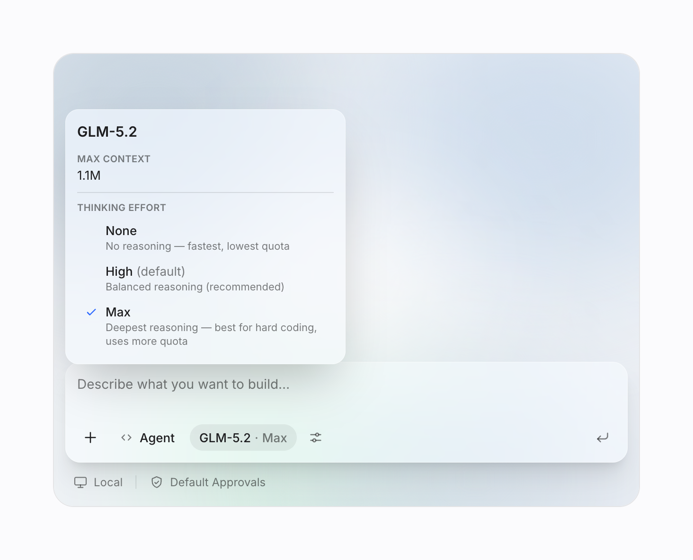
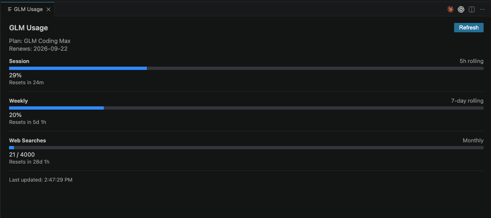

# GLM Models for GitHub Copilot Chat

[](https://marketplace.visualstudio.com/items?itemName=yijiazhen-qi.glm-for-github-copilot-chat)
[](https://marketplace.visualstudio.com/items?itemName=yijiazhen-qi.glm-for-github-copilot-chat)
[](https://marketplace.visualstudio.com/items?itemName=yijiazhen-qi.glm-for-github-copilot-chat)
[](https://github.com/KiwiGaze/glm-for-copilot/actions/workflows/ci.yml)
[](LICENSE.txt)

<p align="center">
  
</p>

Bring Z.AI's GLM models into GitHub Copilot Chat with your own API key (BYOK) — **GLM-5.2**, the 1M-context flagship built for long-horizon coding, plus a curated lineup (GLM-5.1, GLM-5, GLM-4.7, GLM-4.5 Air). No new sidebar or chat UI: the models appear in the picker you already use, with agent mode, tool calling, and thinking through Copilot's native provider path.

> **Unofficial, community-built extension.** Not affiliated with, endorsed by, or sponsored by Zhipu AI, Z.AI, GitHub, or Microsoft. "GLM", "Copilot", and "Visual Studio Code" are trademarks of their respective owners. You bring your own GLM API key and pay your own usage.

## Features

- **GLM-5.2 flagship, right in the picker.** A 1M-token context window, step-by-step thinking that streams live into Copilot's native thinking UI, and a per-model **Thinking Effort** control (None / High / Max) — pick None for faster simple edits. Switch models mid-chat without losing history.

- **Powers Copilot up, doesn't replace it.** GLM models appear alongside GPT and Claude. Because the extension uses Copilot's native Language Model Provider API, agent mode and tool calling keep working as usual.
- **Dual API.** Use your **GLM Coding Plan** subscription or the pay-as-you-go **Standard API** — each available International (`z.ai`) or Mainland China (`bigmodel.cn`). See [Coding Plan vs Standard API](#coding-plan-vs-standard-api).
- **Live usage & balance tracking.** A status-bar readout plus a full **GLM: Show Usage Details** panel. Coding Plan shows session (5-hour) and weekly (7-day) token limits, monthly web searches, and reset countdowns. Standard API shows cash balance and token resource packages. The status bar turns red when quota hits 100% or balance reaches 0. Works on both International (`z.ai`) and Mainland China (`bigmodel.cn`) endpoints for both API modes; no `baseUrl` override.

<p align="center">
  
</p>

- **Keys stay in your OS keychain by default.** **GLM: Set API Key** stores your key via VS Code `SecretStorage` (macOS, Windows, Linux). The extension also honors a settings fallback for CI or automation, so do not put real keys in workspace settings.
- **Zero core runtime dependencies.** Pure VS Code API and Node.js built-ins — the core extension needs no Python, Docker, or local server. (The optional [GLM Vision integration](#image-input-vision) installs an integrity-locked local npm package, so it requires Node.js 18+ with npm.)
- **Add any model.** Newly released, fine-tuned, or proxy-hosted GLM models via [`glm-copilot.customModels`](#settings).
- **See images, even on text-only models.** Install the official **GLM Vision** MCP server with one click and turn on image input: pasted screenshots are analyzed by GLM Vision (GLM-4.6V) and injected as text — code, logs, errors, and UI included — so any GLM model can reason about them. Agent mode also gets the full vision tool set. See [Image input (vision)](#image-input-vision).

## Getting Started

### Prerequisites

- VS Code 1.116 or later
- An active GitHub Copilot subscription (Free, Pro, or Enterprise)
- A GLM API key from [z.ai](https://z.ai/manage-apikey/apikey-list) or [bigmodel.cn](https://open.bigmodel.cn/usercenter/proj-mgmt/apikeys), or a GLM Coding Plan subscription

### Installation

Install from the **[VS Code Marketplace](https://marketplace.visualstudio.com/items?itemName=yijiazhen-qi.glm-for-github-copilot-chat)**, or search **"GLM Models for GitHub Copilot Chat"** in the Extensions panel (`Cmd/Ctrl + Shift + X`):

```bash
code --install-extension yijiazhen-qi.glm-for-github-copilot-chat
```

Upgrading from an older Marketplace listing? Uninstall it first — the old and new IDs can both register the same `glm-copilot.*` commands and settings:

```bash
code --uninstall-extension YijiazhenQi.glm-for-copilot-chat
code --install-extension yijiazhen-qi.glm-for-github-copilot-chat
```

### Usage

1. **GLM: Set API Key** (Command Palette, `Cmd/Ctrl + Shift + P`) → paste your key. GLM key format is `{id}.{secret}`.
2. (Optional) **GLM: Open Settings** to choose your API mode and region.
3. Open Copilot Chat, pick a GLM model (e.g. **GLM-5.2**, the flagship), and start chatting.

Use **GLM: Set API Key** or **GLM: Clear API Key** to update or remove the key later.

## Models

| Model | Tier | Context | Max Output | Available on | Tools | Thinking |
|---|---|---|---|---|---|---|
| **GLM-5.2** | Flagship | 1M | 128K | Coding Plan + Standard | Yes | Yes (effort) |
| **GLM-5.1** | Prior flagship | 200K | 128K | Standard only | Yes | Yes |
| **GLM-5** | Prior flagship | 200K | 128K | Standard only | Yes | Yes |
| **GLM-4.7** | Fast coding | 200K | 128K | Coding Plan + Standard | Yes | Yes |
| **GLM-4.5 Air** | Lightweight | 128K | 96K | Coding Plan + Standard | Yes | Yes |

The picker shows only the models your selected **API Mode** can serve, so you never pick one your plan can't use. GLM-5.2, GLM-4.7, and GLM-4.5 Air work on both; GLM-5 and GLM-5.1 are Standard-only. Need a model not listed — newer (GLM-5-Turbo), older (GLM-4.6), or proxy-hosted? Add it with [`glm-copilot.customModels`](#settings).

## Settings

| Setting | Default | Description |
|---|---|---|
| `glm-copilot.apiMode` | `coding-plan` | Which GLM API to use: `coding-plan` or `standard`. See below. |
| `glm-copilot.region` | `international` | Server region for **both** API modes: `international` (z.ai) or `china` (bigmodel.cn). Ignored only when `baseUrl` is set. |
| `glm-copilot.baseUrl` | *(empty)* | Override the API base URL. Overrides `apiMode` and `region`. Use for proxies or compatible APIs. |
| `glm-copilot.maxTokens` | `0` | Maximum output tokens per request. `0` means no explicit limit (uses API default). |
| `glm-copilot.maxRetries` | `3` | Automatic retries for transient chat failures (HTTP `429`/`5xx`), not counting the first attempt. `0` disables retries (fail fast). Range 0–10. Backoff honors the server's `Retry-After`. |
| `glm-copilot.thinking` | `enabled` | Step-by-step reasoning: `enabled` (higher quality) or `disabled` (faster). Applies to thinking-capable models without a per-model Thinking Effort picker; GLM-5.2 uses None / High / Max in the model picker. |
| `glm-copilot.visionEnabled` | `false` | Accept pasted/attached images in chat when the verified GLM Vision package is installed. GLM Vision analyzes them first so text-only models can reason about them. If the server is unavailable, the reply shows an analysis-failure notice and continues without the image. See [Image input (vision)](#image-input-vision). |
| `glm-copilot.visionPrompt` | *(empty)* | Instruction sent to GLM Vision when analyzing images. Empty uses the built-in prompt (verbatim text/code transcription, UI/diagram/chart description, no speculation). Changing it re-analyzes images on the next turn. |
| `glm-copilot.customModels` | `[]` | Add your own models. Array of model id strings or objects: `{ id, name?, maxInputTokens?, maxOutputTokens?, toolCalling?, thinking? }`. |
| `glm-copilot.modelIdOverrides` | `{}` | Remap a built-in model's API id (keys = picker id, values = id sent to the API). Use for regional endpoints or proxies with different names. |
| `glm-copilot.debugLogging` | `false` | Write verbose debug logs to the GLM output channel. View with **GLM: Show Logs**. |
| `glm-copilot.usageRefreshIntervalMinutes` | `5` | How often (in minutes) to refresh the GLM usage status bar. Minimum `1`. Shows Coding Plan quota or Standard API balance for both `z.ai` and `bigmodel.cn` regions. Only when no `baseUrl` override. |
| `glm-copilot.showUsageStatusBar` | `true` | Show the GLM usage status-bar item. Coding Plan quota or Standard API balance, both `z.ai` and `bigmodel.cn` regions. Only when no `baseUrl` override. |

## Coding Plan vs Standard API

**Coding Plan** requires a GLM Coding Plan subscription — best for teams or high-volume coding. **Standard API** is pay-as-you-go via the GLM Open Platform. The endpoint follows your `region` either way.

| Mode | Region | Endpoint | Get a key |
|---|---|---|---|
| Coding Plan | International | `https://api.z.ai/api/coding/paas/v4` | [z.ai/manage-apikey/subscription](https://z.ai/manage-apikey/subscription) |
| Coding Plan | Mainland China | `https://open.bigmodel.cn/api/coding/paas/v4` | [bigmodel.cn/coding-plan](https://bigmodel.cn/coding-plan/personal/overview) |
| Standard | International | `https://api.z.ai/api/paas/v4` | [z.ai/manage-apikey/apikey-list](https://z.ai/manage-apikey/apikey-list) |
| Standard | Mainland China | `https://open.bigmodel.cn/api/paas/v4` | [open.bigmodel.cn](https://open.bigmodel.cn/usercenter/proj-mgmt/apikeys) |

Full API documentation: [docs.z.ai](https://docs.z.ai).

Usage details rely on regional usage endpoints (`api.z.ai` for International, `open.bigmodel.cn` for Mainland China) that are not part of the public chat-completions API. If those endpoints are unavailable or change, the extension degrades to a status message instead of blocking chat.

## Image input (vision)

Vision is powered by the official **[Z.AI Vision MCP server](https://docs.z.ai/devpack/mcp/vision-mcp-server)** (`@z_ai/mcp-server`, GLM-4.6V). Setup is two steps, and nothing is installed without your say-so:

1. **Install the server** — run **GLM: Install GLM Vision MCP Server** (or the Install button in the Getting Started walkthrough). Before anything is downloaded, a modal confirmation explains that the third-party package runs locally, receives your GLM API key and attached-image paths, and sends image content to Z.AI or BigModel. After consent, the flow checks your API key and Node.js/npm (Node.js 18+, 22+ recommended), then installs `@z_ai/mcp-server@0.1.4` under the extension's global storage with `npm ci`. A bundled lockfile pins the complete dependency graph and its SHA-512 integrity hashes, and npm lifecycle scripts are disabled. VS Code launches the fixed local entry point — never a later package fetched by `npx` — with `Z_AI_MODE` set from your region (`ZAI` for International, `ZHIPU` for Mainland China). Your stored API key (VS Code `SecretStorage`, or the settings fallback if you use one) is injected only when VS Code starts the server. Remove the registration, installed npm package, toggle, and temp images any time with **GLM: Uninstall GLM Vision MCP Server**.
2. **Turn on image input** — after installation, **GLM: Toggle Vision for Chat Models** appears in the Command Palette. Turn it on while the server is healthy, or set [`glm-copilot.visionEnabled`](#settings). Every GLM model in the picker then accepts image input. A temporary server outage does not remove image support from the model picker.

Each time image input changes from off to on, the extension waits until VS Code can see `GLM Vision > analyze_image`, then shows approval guidance. To stop the repeated confirmation before each analysis:

- Select **Manage Tool Approval** in the notice.
- In the workspace Tool Approval manager, find **GLM Vision > analyze_image**.
- Enable **without approval** only for that tool.

The extension does not change approval settings or approve tools for you. Organization policy can still require confirmation.

With image input on, pasted or attached images just work — even for text-only chat models:

- **Analyzed by GLM Vision** — each image is written to a local temp file and analyzed through the server's `analyze_image` tool on your stored key, and the analysis is injected into the request as text *before* it reaches your selected chat model. The instruction is configurable via **GLM: Edit GLM Vision Prompt** or [`glm-copilot.visionPrompt`](#settings); changing it re-analyzes images on the next turn.
- **Cached** — analyses are content-addressed and cached in memory for the session (never written to extension storage), so conversation history is not re-analyzed every turn.
- **Validated** — images larger than 5 MB, or outside `png` / `jpeg`, are skipped with a clear notice *before* any tool call.
- **Visible progress, graceful failure** — a status line streams into the thinking block while analysis runs. If analysis fails or the server stops, the model keeps image input enabled, but the reply continues without the image and opens with a short "image analysis failed" notice instead of erroring out. Turning vision off or uninstalling the package removes image input from the model picker.

In **agent mode** the server's full tool set is also available directly to the agent — UI-to-code, screenshot OCR, error-screenshot diagnosis, diagram/chart analysis, UI diffing, and video understanding. For images on disk, the agent calls these tools itself with the file path; no extra setup needed.

## Commands

| Command | Description |
|---|---|
| **GLM: Set API Key** | Set or update your GLM API key |
| **GLM: Get API Key** | Open the key management page for your selected API mode |
| **GLM: Clear API Key** | Remove your stored API key |
| **GLM: Open Settings** | Open the extension settings |
| **GLM: Show Logs** | Open the GLM output channel |
| **GLM: Refresh Usage** | Refresh GLM usage/balance now (Coding Plan quota or Standard API balance; both `z.ai` and `bigmodel.cn`) |
| **GLM: Show Usage Details** | Open the GLM usage panel (Coding Plan quota or Standard API balance; both `z.ai` and `bigmodel.cn`) |
| **GLM: Install GLM Vision MCP Server** | Review the impact, then install the integrity-locked local package. Visible when not installed |
| **GLM: Uninstall GLM Vision MCP Server** | Remove the GLM Vision MCP server and revert models to text-only. Visible when installed |
| **GLM: Edit GLM Vision Prompt** | Open the multiline setting for the image-analysis instruction. Visible when installed |
| **GLM: Toggle Vision for Chat Models** | Turn image input for chat models on/off. Visible while GLM Vision is installed |

## Frequently asked questions

### Is this an official GLM or GitHub extension?

No. Unofficial, community-built, open source — not affiliated with Zhipu AI, Z.AI, GitHub, or Microsoft. It just lets you use your own GLM API key inside Copilot Chat.

### Do I still need a GitHub Copilot subscription?

Yes. This adds GLM models *to* Copilot Chat; it doesn't replace Copilot. You need an active Copilot subscription (Free, Pro, or Enterprise) and your own GLM API key.

### Where does my API key go?

**GLM: Set API Key** stores it in VS Code `SecretStorage` (the OS keychain on macOS, Windows, Linux), and requests send it only to your configured GLM endpoint over HTTPS. A settings fallback exists for CI or automation, but avoid putting real keys in `settings.json`, especially workspace settings that could be committed.

### Can I use a proxy or self-hosted endpoint?

Yes. Set `glm-copilot.baseUrl` to any OpenAI-compatible endpoint; it overrides `apiMode` and `region`.

### Is GLM-4.6 still supported?

GLM-4.6 was superseded by GLM-4.7 and the GLM-5 series in v0.2.0. Add it with `glm-copilot.customModels` if your account still serves it.

## Contributing

Contributions welcome — see the [contributing guide](CONTRIBUTING.md) and [Code of Conduct](CODE_OF_CONDUCT.md). All PRs require code-owner review and are never auto-merged.

- **Bug?** [Open a report](https://github.com/KiwiGaze/glm-for-copilot/issues/new?template=bug_report.yml) · **Feature?** [Request it](https://github.com/KiwiGaze/glm-for-copilot/issues/new?template=feature_request.yml)
- **Help?** [Support](SUPPORT.md) or [Discussions](https://github.com/KiwiGaze/glm-for-copilot/discussions) · **Security?** [Policy](SECURITY.md)

## Changelog

See [CHANGELOG.md](CHANGELOG.md).

## License

[MIT](LICENSE.txt) © GLM Models for GitHub Copilot Chat contributors
